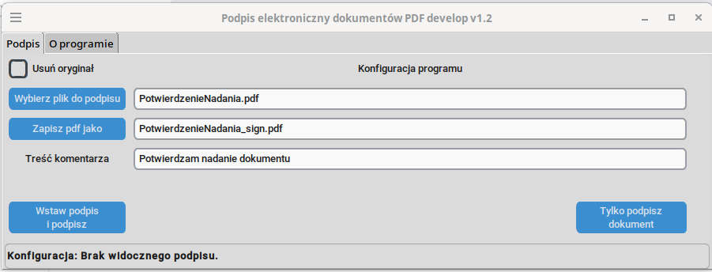
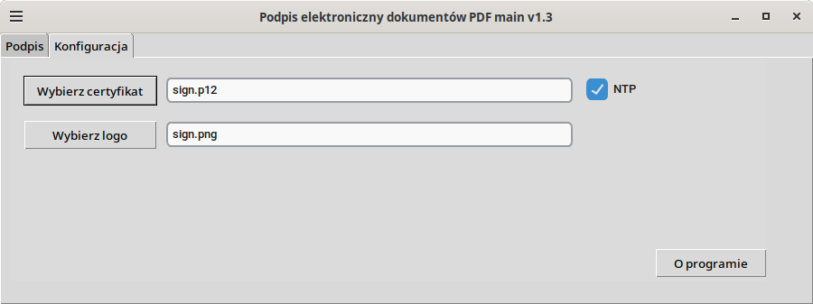
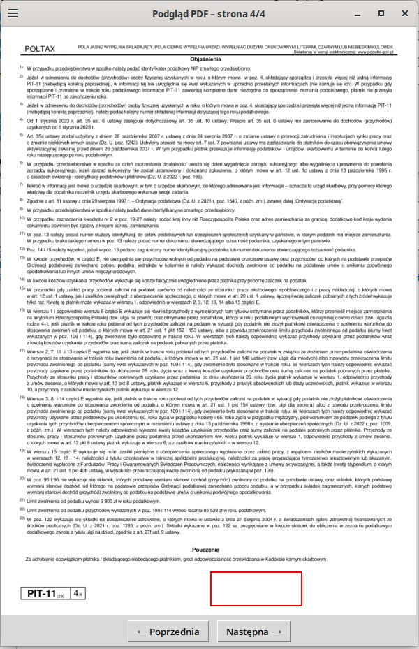

<h1 align="center">
SignPdf
</h1>

## Opis programu

Aplikacja do podpisu dokumentów pdf w oparciu o bibliotekę pyhanko za pomocą certyfikatu PKCS#12.
Plik z rozszerzeniem .p12. to kontener kryptograficzny formatu PKCS#12, służący do bezpiecznego przechowywania certyfikatów cyfrowych oraz prywatnych kluczy. Jest to zaszyfrowany plik, który zabezpiecza poufne dane (np. do podpisywania dokumentów pdf, e-mail S/MIME, czy uwierzytelniania w sieciach) i jest powszechnie używany w systemach Windows, macOS oraz Linux.  
Program stworzony w środowisku <a href="https://vscodium.com/" style="color: inherit; text-decoration: none;">VSCodium</a> w <a href="https://www.python.org/" style="color: inherit; text-decoration: none;"> Pythonie</a> dla środowiska <a href="https://www.linux.org/" style="color: inherit; text-decoration: none;"> Linux</a> na licencji <a href="https://www.gnu.org/licenses/gpl-3.0.en.html" style="color: inherit; text-decoration: none;">GNU GPL v3</a> <a href="https://ubuntu.pl/czytelnia/2008/03/12/polskie-tlumaczenie-gpl-v3/" style="color: inherit; text-decoration: none;">(wersja PL)</a>.

## Funkcje:

### 1. Tryb CLI

* SignPdf /sciezka/do/dokumentu.pdf - po otwarciu tryb GUI z przygotowanym dokumentem do podpisu
* SignPdf /sciezka/do/dokumentu.pdf -no_gui - sam podpis dokumentu ustawieniam zapamiętanymi ustawieniami w programie

### 2. Tryb GUI

* Podpis z widoczną pieczątką
* Podpis niewidoczny
* Obsługa certyfikatu zabezpieczonego hasłem
* Wybór loga
* Wybór certyfikatu
* Wybór podpisywanego dokumentu i miejsca zapisu pliku wynikowego
* Możliwość automatycznego usunięcia dokumentu do podpisu
* Tekst dla podpisanego dokumentu
* Możliwość wskazania strony i miejsca gdzie będzie utworzony stempel

## GUI - interfejs graficzny urzytkownika

### 1. Okno główne

### 2. Ustawienia programu i informacja

### 3. Wybór miejsca dla pieczątki

### Autor:

Mariusz Dyla - [dilmark](https://dilmark.pl/)